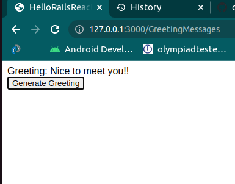

# Hello Rails React App

> This project is a test for creating a rails and react applications in one app.

Additional description about the project and its features.

## Built With

- Ruby
- JavaScript
- Rails react
- webpack

## Getting Started

**to start this application open these files in vscode then run `rails c` now create new messages to store them in your database then run `rails s` in your vscode terminal then open another bash and run `bin/webpack-dev-server` then open the localhost in your browser then go to this directory `\GreetingMessages` press the generate greeting button know you can see a greeting from your database**

To get a local copy up and running follow these simple example steps.

### Prerequisites
 - Ruby
 -rails
 -node.js
 -Vscode

## Authors

👤 **Meqdam Al-qudah**

- [GitHub](https://github.com/MeqdamAlqudah)
- [Twitter](https://twitter.com/MeqdamQudah)
- [LinkedIn](www.linkedin.com/in/meqdam-al-qudah-7514a21b5)

## Show your support

Give a ⭐️ if you like this project!

## 📝 License

This project is [MIT](./MIT.md) licensed.
